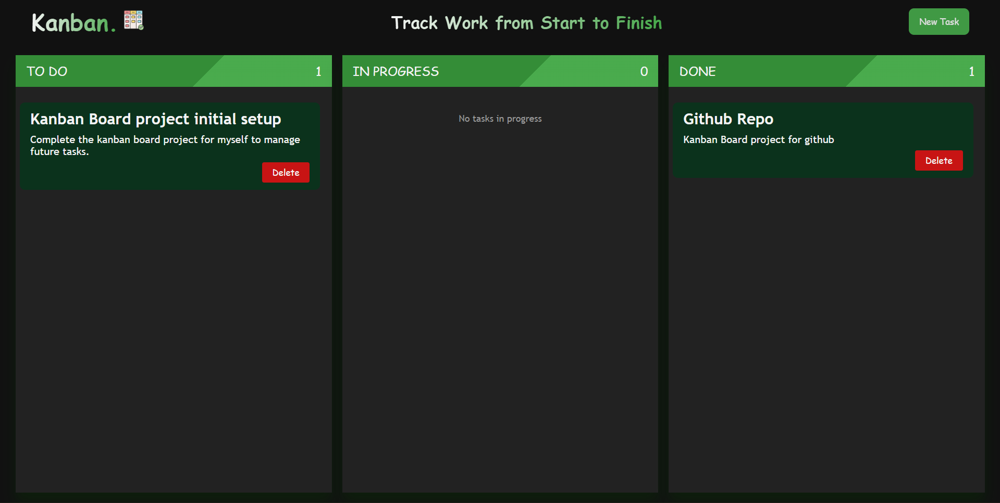

# 🗂️ Kanban Board (v1)

A simple **Kanban Board** built with **Vanilla JavaScript**, supporting drag-and-drop task management, task persistence using `localStorage`, and dynamic UI updates.

This is **Version 1**, focused on core Kanban functionality without any frameworks.

---

## 🌐 Live Demo

🚀 **Live Link:**  
https://kanbanboardv1.vercel.app/

---

## 🚀 Features

- ✅ Add new tasks with title and description
- 🧲 Drag & drop tasks between columns
- 🗑️ Delete tasks
- 📊 Live task count per column
- 🫙 Persistent data using `localStorage`
- 🧼 Clean empty-state handling (e.g., “No tasks”)
- 💡 Modular & readable JavaScript logic

---

## 📸 Screenshots

### Kanban Board – Overview

### Add Task Modal

## 📁 Columns

- **Todo**
- **In Progress**
- **Done**

Each column:

- Shows task count
- Displays an empty message when no tasks are present
- Updates automatically on add, delete, or drag

---

## 🛠️ Tech Stack

- **HTML**
- **CSS**
- **JavaScript (Vanilla)**

No libraries or frameworks used.

---

## 📦 How It Works

### ➕ Add Task

- Enter title & description
- Task is added to the **Todo** column
- Data is saved to `localStorage`

### 🧲 Drag & Drop

- Tasks are draggable across columns
- Column highlights on drag-over
- State updates on drop

### 🗑️ Delete Task

- Removes task from DOM
- Updates count & empty state
- Syncs changes to `localStorage`

### 💾 Persistence

- Tasks are stored in `localStorage`
- Reloading the page restores board state

---

## 🧠 Key Concepts Used

- Drag & Drop API
- Event Delegation
- DOM Manipulation
- `localStorage`
- Array & NodeList handling

---

## ⚠️ Known Limitations (v1)

- No edit task feature
- No mobile drag support
- No backend (localStorage only)

---

## 🔮 Future Improvements (v2+)

- ✏️ Edit task functionality
- 🏷️ Task labels & priorities
- 📱 Mobile drag support (Responsiveness)

---

## 👨‍💻 Author

**Rounak Bakshi**

Feel free to fork, improve, or suggest enhancements 🚀

---

## ⭐ If you like this project

Give it a ⭐ on GitHub — it really helps!
