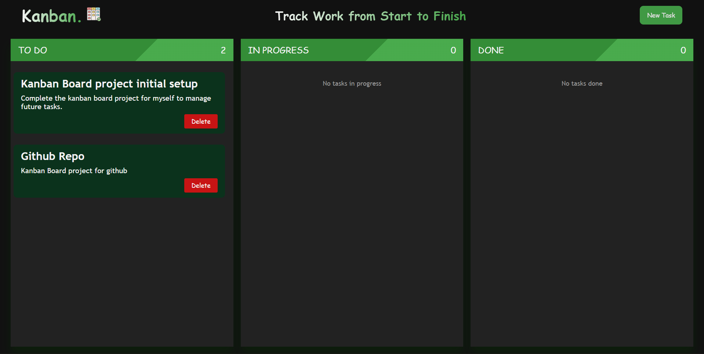
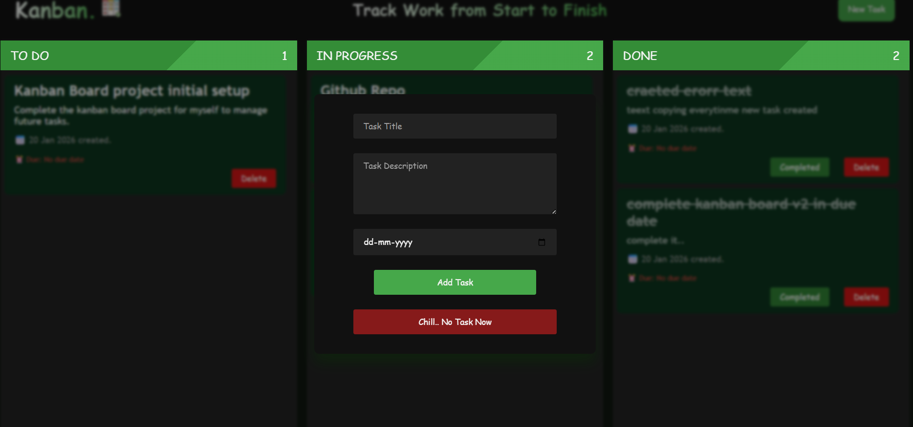
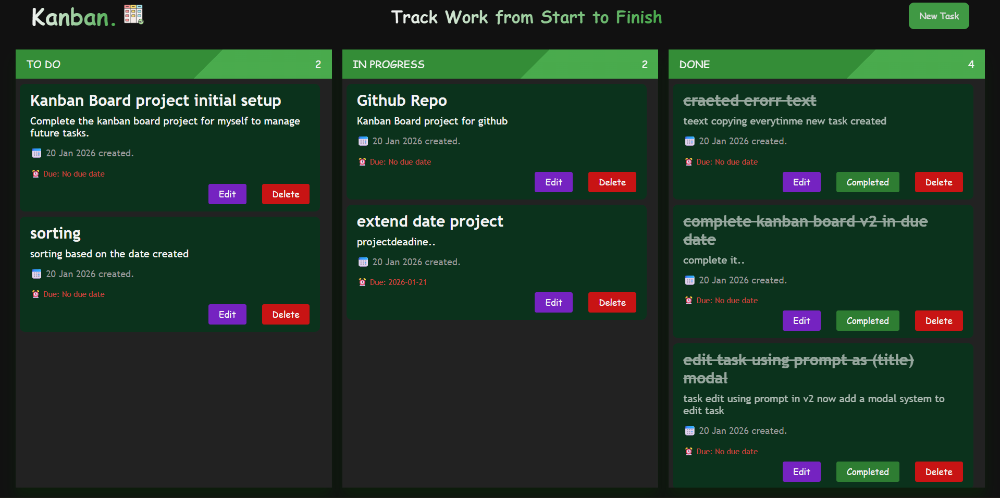

# 🗂️ Kanban Board (v1)

A simple **Kanban Board** built with **Vanilla JavaScript**, supporting drag-and-drop task management, task persistence using `localStorage`, and dynamic UI updates.

This is **Version 1**, focused on core Kanban functionality without any frameworks.

---

## 🌐 Live Demo

🚀 **Live Link:**  
https://kanbanboardv1.vercel.app/

---

## 🚀 Features for (v1)

- ✅ Add new tasks with title and description
- 🧲 Drag & drop tasks between columns
- 🗑️ Delete tasks
- 📊 Live task count per column
- 🫙 Persistent data using `localStorage`
- 🧼 Clean empty-state handling (e.g., “No tasks”)
- 💡 Modular & readable JavaScript logic

---

## 📸 Screenshots

### Kanban Board – Overview

## 📷 Project Preview

| Kanban Board                            | Add Task Modal                          |
| --------------------------------------- | --------------------------------------- |
|  |  |
| Main Kanban board with all columns      | Modal for creating a new task           |

| Done Task State                             | Another Feature                           |
| ------------------------------------------- | ----------------------------------------- |
|  |  |
| Completed task with line-through state      | v3 ready Kanban board                     |

### 🔹 Version 2 (v2) — Persistent & Interactive Board

**Goal:** Improve usability, persistence, and task lifecycle handling.

#### New & Enhanced Features

##### ✅ Advanced Task Data

- Tasks include:
  - **Created date**
  - **Optional due date**
- Clean date formatting and rendering

##### 🖱️ Improved Drag & Drop

- Smooth task movement between columns
- Automatic task count updates
- Column empty-state handling

##### ✔️ Completion Workflow

- When a task is moved to the **Done** column:
  - A **“Done?”** button appears
  - Clicking it:
    - Marks the task as completed
    - Applies **line-through** styling to the title
    - Button text changes to **“Completed”**
- Completion state is saved and restored using `localStorage`

##### 💾 Persistent State (localStorage)

- All tasks are saved with:
  - Title & description
  - Created date & due date
  - Column position
  - Completion status
- Board restores correctly after page reload

##### 🎨 UI & UX Improvements

- Hidden scrollbars for a clean dashboard look
- Visual distinction for completed tasks
- Flex-based task action buttons
- Modern dark-themed interface

---

## 🚀 Kanban Board – Version 3 (v3)

Version 3 focuses on **editing, persistence, and UX improvements**, making the board more practical for real-world usage.

---

### ✨ What’s New in v3

#### ✏️ Edit Task (Modal Based)

- Added an **Edit button** on each task
- Opens a **custom modal (not browser prompt)**
- Allows editing:
  - Task title
  - Task description
  - Due date
- Modal is pre-filled with existing task data
- Clean UI consistent with the Add Task modal

---

#### 💾 Persistent Edits (LocalStorage)

- Any edit is **immediately saved to LocalStorage**
- On page reload:
  - Edited title & description remain intact
  - Due date updates persist correctly
  - Task status remains unchanged

---

#### 📅 Correct Created Date Handling

- Fixed bug where task `created date` changed after reload
- Now:
  - Created date is stored once at task creation
  - Reloading the app shows the **original creation date**

---

#### 🧠 Improved UX Details

- No browser `prompt()` usage (fully custom modals)
- Better date handling (`No due date` fallback)
- Clean and minimal modal UI
- Smooth user experience for editing and managing tasks

---

# 🗂️ Kanban Board (v3.1)

## ✨ Features (v3.1)

- ➕ Add tasks with title, description, created date & due date
- ✏️ Edit tasks using a modal (no prompts)
- 🧲 Drag & drop between **To Do**, **In Progress**, and **Done**
- ✅ Mark tasks as completed with visual line-through
- 📅 Persist **created date**, **due date**, and **completed state**
- 🔃 Sort tasks by **created date** (newest first)
- 💾 Full `localStorage` persistence
- 📊 Live task count per column
- 🧹 Empty-state handling for columns

---

## 🚀 Version v3.2 – Overdue Highlight

### ✨ What’s New

- Tasks with a **past due date** are automatically highlighted.
- Helps quickly identify missed or urgent tasks.
- Overdue styling is **disabled for completed tasks**.

### 📷 Overdue Task Preview

### 🧠 How It Works

- Compares task `dueDate` with today’s date.
- If `dueDate < today` **and task is not completed**, an `overdue` class is applied.
- Completed tasks remove overdue styling automatically.

### 🎨 Visual Indicator

- Overdue tasks are shown with a **red border** for instant visibility.
- Completed tasks override overdue state.

### 🛠️ Tech Used

- Vanilla JavaScript (Date comparison)
- CSS class-based highlighting
- LocalStorage state persistence

✔️ Improves task awareness  
✔️ Keeps UI clean and intuitive  
✔️ Fully backward-compatible with v3

---

## 📁 Columns

- **Todo**
- **In Progress**
- **Done**

Each column:

- Shows task count
- Displays an empty message when no tasks are present
- Updates automatically on add, delete, or drag

---

## 🛠️ Tech Stack

- **HTML**
- **CSS**
- **JavaScript (Vanilla)**

No libraries or frameworks used.

---

## 📦 How It Works

### ➕ Add Task

- Enter title & description
- Task is added to the **Todo** column
- Data is saved to `localStorage`

### 🧲 Drag & Drop

- Tasks are draggable across columns
- Column highlights on drag-over
- State updates on drop

### 🗑️ Delete Task

- Removes task from DOM
- Updates count & empty state
- Syncs changes to `localStorage`

### 💾 Persistence

- Tasks are stored in `localStorage`
- Reloading the page restores board state

---

## 🧠 Key Concepts Used

- Drag & Drop API
- Event Delegation
- DOM Manipulation
- `localStorage`
- Array & NodeList handling

---

## ⚠️ Known Limitations (v1)

- No mobile drag support
- No backend (localStorage only)

---

### 📌 Current Features Summary (v3)

- Create tasks with title, description & due date
- Drag & drop between columns
- Mark tasks as completed
- Edit tasks using modal
- Delete tasks
- Task count per column
- Full LocalStorage persistence

---

## 📌 Why This Project Matters

This project demonstrates:

- Strong understanding of JavaScript fundamentals
- Ability to manage UI state without frameworks
- Clean DOM-based architecture
- Incremental feature development using versioning
- Practical problem-solving for real-world UI behavior

---

## 👨‍💻 Author

**Rounak Bakshi**

Feel free to fork, improve, or suggest enhancements 🚀

---

> 💡 This project is built to strengthen core JavaScript concepts like DOM manipulation, state management, and UI logic without any frameworks.

## ⭐ If you like this project

Give it a ⭐ on GitHub — it really helps!
